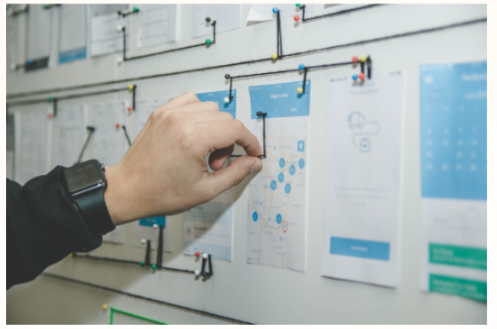

# Tailwind Hero Landing Page

A modern and responsive **Hero Landing Page** built using **HTML5** and **Tailwind CSS**.
The page demonstrates a clean SaaS-style landing page with a navigation bar, hero section, call-to-action buttons, floating information cards, and a fixed chat button.

## 📌 Project Overview

This project is a simple landing page designed for a productivity/project-management application.

It includes:

- Responsive navigation bar
- Project logo and navigation links
- Hero section with heading and description
- Call-to-action buttons
- Hero image
- Floating task/status/activity cards
- Responsive layout using Tailwind CSS
- Fixed chat button
- Mobile navigation button
- Gradient hero background

## 🛠️ Technologies Used

- **HTML5**
- **Tailwind CSS v4**
- **JavaScript CDN**
- **Responsive CSS Utilities**
- **Google Chrome / Modern Browser**

## 📂 Project Structure

```text
Tailwind-Hero-Landing-Page/
│
├── index.html
├── hero.jpg
└── README.md
```

### Files Description

| File         | Description                                         |
| ------------ | --------------------------------------------------- |
| `index.html` | Main HTML file containing the complete landing page |
| `hero.jpg`   | Hero section image                                  |
| `README.md`  | Project documentation                               |

## ✨ Features

### 1. Responsive Navbar

The navigation bar contains:

- Project logo
- Product
- Solutions
- Resources
- Pricing
- Log in
- Get AI Free button
- Mobile menu button

Tailwind responsive utilities are used to hide/show navigation elements depending on screen size.

### 2. Hero Section

The hero section contains:

```text
Write, plan, share.
With AI at your side.
```

It also includes a short description and two CTA buttons:

- **Get AI free**
- **Request a demo**

### 3. Hero Image

The page displays a centered `hero.jpg` image inside the hero section.

Make sure `hero.jpg` is located in the same folder as `index.html`.

```html

```

### 4. Floating Information Cards

Three cards are positioned around the hero image:

#### Tasks

Displays:

```text
12 tasks completed today
```

#### Project Status

Displays:

```text
On Track
```

#### Team Activity

Displays:

```text
+ 5 online
```

These cards use Tailwind's absolute positioning and shadow utilities.

### 5. Chat Button

A fixed chat button is displayed in the bottom-right corner of the screen.

```html
<button aria-label="open chat" class="fixed bottom-6 right-6 ...">💬</button>
```

## 📱 Responsive Design

The page uses Tailwind's responsive breakpoint utilities.

## 🚀 How to Run

### Step 1: Download or Clone the Project

Clone the repository:

```bash
git clone <your-github-repository-url>
```

Or download the project as a ZIP file.

### Step 2: Open the Project

Open the project folder in **VS Code**.

### Step 3: Check the Image

Make sure the following file exists:

```text
hero.jpg
```

in the same directory as:

```text
index.html
```

### Step 4: Run the Project

You can open `index.html` directly in a browser.

For a better development experience, use **VS Code Live Server**.

Right-click:

```text
index.html
```

and select:

```text
Open with Live Server
```

## 🎨 Tailwind CSS

This project uses Tailwind CSS through the CDN:

```html
<script src="https://cdn.jsdelivr.net/npm/@tailwindcss/browser@4"></script>
```

No Tailwind installation or build configuration is required.

## 📚 Learning Objectives

This project is useful for practicing:

- HTML semantic structure
- Tailwind CSS utility classes
- Flexbox
- Absolute positioning
- Responsive design
- CSS gradients
- Shadows
- Spacing utilities
- Typography utilities
- Responsive breakpoints
- Accessibility basics
- Landing page UI development

## 👩‍💻 Author

**Ankita Mahaseth**

Frontend / Full-Stack MERN Developer

Skills:

- HTML
- CSS
- JavaScript
- React.js
- Node.js
- Express.js
- MongoDB
- Tailwind CSS

## 📄 License

This project is created for **learning and portfolio purposes**.

You are free to modify and customize the project for your own learning and development.
